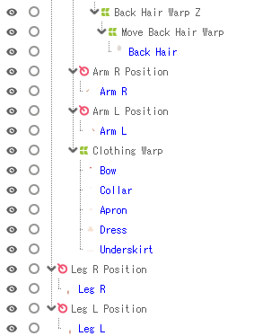

# Live2d for Beginners!

## Intro

Live2d can be hard to learn. But so is art, and if you're here in the first place you're probably smart enough to figure it out ;) 

You've probably watched a lot of video tutorials already and followed some social media accounts. Maybe you joined a Discord channel. HOWEVER!!! I am a millennial with the mind of a boomer sometimes and while I find videos and channels helpful, I found myself wanting some kind of easy to follow formula to use as a reference- because creating a vtuber in live2d is a VERY complex process.

You may find that you are getting very comfortable creating a mesh atlas and sorting your parts into folders, but suddenly you realize you need to replace one of your layers and can't remember how. That's what this is for!!! No more hunting through timestamps in YouTube videos or scrolling through your liked tweets- this guide is organized just for your reference!

That being said, all our brains work a little different so you may be surprised how I organized this guide. So just to make it even easier for you, I'm going to provide a few different linked table of contents so you can easily skip around. 

Have fun! This is the start of a grand adventure! :D

- [Live2d for Beginners!](#live2d-for-beginners)
  - [Intro](#intro)
  - [brainstorming](#brainstorming)
  - [drawing](#drawing)
  - [the basic concepts of live2d](#the-basic-concepts-of-live2d)
  - [importing to live2d](#importing-to-live2d)
  - [animating in live2d](#animating-in-live2d)
    - [Tips:](#tips)
    - [basic workflow:](#basic-workflow)
    - [specific workflows for different parameters:](#specific-workflows-for-different-parameters)
    - [hair physics](#hair-physics)
  - [export model](#export-model)
  - [import model to vtube studio](#import-model-to-vtube-studio)
  - [fixing tracking in vtube studio](#fixing-tracking-in-vtube-studio)
  - [how to connect vtube studio to OBS](#how-to-connect-vtube-studio-to-obs)

## brainstorming
    
 1. Make a pinterest board- but also check out youtube vtuber showcases and deviantart or whatever site u vibe with.
	 -   make sure to have hair, outfit, and eye inspo!
	 - include objects and colors that strike your fancy
	 - and a little bit of photo inspo is good too! (especially if u dont only want to draw pale wispy waifus)

 
 2. Find one or two main motifs to feature (strawberries, cows, stars, leaves, bandages, whatever) 
 3. Find a main shape for the outfit- bell, flower, pumpkin, etc 

[example of outfit shapes]

4. Design the eyes separately to get all the detail in there

[example of eye shapes]

6. Find a main shape for the hair & determine bang shape (also think about which strands of hair should move separately from others and outline them separately) 

[examples of hair shapes] 

7. Sketch shape of the entire
    model 

don't make fun of me i tried my best lmfao

8. Add color to the sketch

[example of colored sketch]

## drawing
    
1. take your colored sketch and begin tracing over it on separate layers to create final pieces
	  -   i usually keep lineart and highlights/shadows on separate layers until i’m totally (or at least kind of totally) done

[example of layers on drawing]
- recommendation: use a guide image for the first few models. this will show you which things should be on separate layers [insert actual complete list of guide image layers?]
 
	 -   eyes: keep eyelashes and potentially eyelids on separate layers from pupil/iris/highlight (i dont care enough to animate the pupil/iris/highlight separate from each other, i feel like theres no way u notice it in the actual stream)
        -   clothes: keep every layer of fabric separate to create realistic motion
        -   hair: keep every piece of hair that would be heavier/lighter/curling a different direction from other hair, on a separate layer (front & side bangs separate, flyaway hairs and extensions separate, etc)
        -   mouth: create dark shape for inner mouth, slightly lighter shape for tongue, full set of teeth as viewed from the front, and two separate lines for lips (with each line having the face’s flesh tone colored in above/below it in order to mask the dark mouth shape)
    -   NAME YOUR LAYERS APPROPRIATELY OR ELSE U WILL CRY LATER

  
here is a map of all the layers I ended up with:

   

2. export to psd
## the basic concepts of live2d
    
i’ve never animated before so sorry if this is obvious to others, but i think it’s valuable if you’ve only worked on static 2d art before

For the sake of being able to provide actual screenshots, I'm going to be using VTube studio on an iphone as my motion tracking software. For a comparison of different methods of motion tracking, please see [this section]

One last tip- I strongly recommend downloading the example model "hiyori" from the liv2d Resoures site. Opening her in one tab and your model in another will be very helpful with comparison, even though she is simpler than most vtuber models. 

[insert illustrations of each concept below each point]
 -   to create a motion-tracked model that moves with you, you need to tell the computer that YOUR specific movements should translate to THE MODEL doing specific movements.
 - There are basically a few layers to this process:
 1. first your camera captures your face and sends it to VTube Studio.
 2. Then, Vtube studio creates a basic map of the face that looks like a bunch of points connected together. This is how it interprets your very complex face into a something simple and easy to deal with.
 3. VTube studio basically sees your expressions as number values. So if your right eye opens really wide, that might be a "1.2," if it's open a normal amount that's a "1.0"  if it squints a bit, that's "0.2" and if it closes all the way that's "0." 
 4. So how does it create a Vtuber out of your expressions? Well, that's where your rigged live2d model comes in. Basically your model is saying "when my eyes are really wide open (value for right eye open = "1.2"), the model's eyes should look like THIS." Or, "When my mouth is in smiling position (mouth form="1.0") and my eyes are closed (right and left eye open="0"), make my eyes look like half moons." This means you can create a very stylized, expressive model even if your irl face isn't moving very much, which is very nice because most of us don't look like anime cartoons in real life lol.

  -   live2d basically prepares your motion tracking software to know how your model should move, based on these different values. So if your right eye irl moves to the right, your model eye should also do that, and if your eye closes, your model’s iris/pupil/eye white should become thin/invisible

  SO HOW DO YOU MAKE THE MODEL MOVE AROUND??
  -   the way you do that is by creating MESHES (a kind of dot map of the given layer) which you can then warp based on what that piece should be doing - so for example, when the eye is in the “closed” position, you can warp the iris/pupile/eye white to be small enough to be hidden behind the eyelash
  -   so how does the program know when the eye is in the “closed” position? that’s where parameters come in. they are basically responses to different situations. 
  - so for your eye, you probably want an “open,” “closed” and “half-open” response based on what your irl eye is doing. 
  - you do this by adding points to the parameter line - in this case it would be three points, which each have three values (the default values are -1, 0, and 1). 
  - Your motion tracking software (in my case vtube studio) will be able to track you by assigning a number to your face (eye open = 1, eye squinting = 0, eye closed = -1) and matching it to the appropriate animated response. this is why it’s important to keep track of the values you assign the parameters in live2d
  -   there’s also a difference between MESHES and DEFORMERS- meshes allow you to warp the layer based on its unique contours, whereas deformers warp based on a grid (or an axis in the case of rotation deformers). 
  - they are more useful for when something should simply be moving around in 3d space, rather than changing its shape completely (for example, moving the head to look up and down would be a job for a deformer, whereas the mouth closing and opening would require you to be more precise and use the mesh to change the shape of the upper or lower lip)
  -   lastly there are physics which basically uses physics simulation to link two different parameters so that one causes the other to occur. it’s just useful for hanging things like boobies, hair, or necklaces
  -   so to recap: the basic tools you use to create your vtuber are MESHES, DEFORMERS, and PARAMETERS. because there are so many of each, it’s crucial to keep them organized in folders and with clear names.
## importing to live2d
 
  Before you start:

  Here are the windows you'll want in your workspace:
  - Tool Details - important for working with art meshes
  - Inspector - important for 
  - Part - list of all parts
  - Deformer
  - Parameter

 [include screenshots of each step]
 
1. just click and drag that sucker into the program! This is the same method you'll use if you need to update the psd 
2. Notice how my parts are already organized into folders just like my .psd! It's a bit handy

- aside- as you continue to make more models, you will find that you can save certain presets for most of these steps. I'll try to include that info as we go along!

3. create folders for parameters 

  
  
  And you can change the color! Do yourself a favor and color code- you can even use the eyedropper tool to get colors from the model! 

  

  (mine looks like the lesbian pride flag lmao)
	
  This is how to organize the default parameters included with the program (I delete most of the brow deformers because I don't need all that lol)
    
   - Face: Angle X, Angle Y, Angle Z
    - Eye: Eye L Open, Eye L Smile, Eye R Open, Eye R Smile
	  - Eyeball: Eyeball X, Eyeball Y
	  - Brow: Brow L Form, Brow R Form
	  - Mouth: Mouth Form, Mouth Open
	  - Body: Body X, Body Y, Body Z, Breath
	  - Move: any hair parameters

  I'm also going to create new deformers for my arms and legs since I designed them to be able to move. I only need one for both arms and one for both legs because they are not going to move independently!
  (include link to guide on naming new params)

  Once you have done that, go to Modeling -> Bulk setting of model parameters -> Export. This way you don't have to start from scratch next time!

4. use automatic mesh generator - CMD/CTRL + A to select all parts, click the button (include screenshot)! There should be 3 presets- Standard, Deformation (Heavy), and Deformation (Little). Standard is fine to start with if you're a beginner. However, I like to start with a little more refinement! Here are my custom settings (you can save them by clicking "Add" and naming them for future ease of use)
  

Comparison:

  with standard mesh:

  
  
  with my mesh settings: 

  

5. specify draw order - draw order refers to the position of each layer on top of another. A layer with draw order of 500 will be in front of/on top of a layer with draw order of 499, and behind one of 501. There are best practices for draw order to save yourself headaches if you start needing to add new layers in between!

    TIP: hold E + click and drag to view the draw order in 3d!!

    
    lol

6. refine those meshes - needs separate section

    SIDE NOTE: Live2d hates me and wants to delete the nose every time I make the meshes. I literally just have to create the nose mesh manually and even then it won't show up. I have to edit it and ctrl + z until it shows up.... 

    ALSO! Note how this arm got fucked up for some reason in the process of auto generating the meshes (and yes I was getting little red error messages about the mesh being open and I just ignored it):

    
    
    closeup when arm is selected (so you can see the mesh)

    

    all it takes is click the dot, click on another part of the mesh to connect, and voila!

    

    So I manually edited the mesh and closed it! Ta-dahhh no more rip

    The reason you want to refine the meshes BEFORE you generate the texture atlas is that the default meshes (if you use the "Standard" setting) are very OVERSIZED. And unfortunately, that will make it tricky to fit everything onto the texture atlas. If you're just going to have to change them later anyway, I recommend doing it before you make that texture atlas so that you don't need to shrink everything down. 
    
    HOW DO YOU EDIT A MESH
7. create texture atlas - 

    WHAT IS A TEXTURE ATLAS??

    This is where they get you for the free version. I have never been able to make a texture atlas at 2048px with 100% sizing for my parts without a struggle. And I usually don't draw at a gigantic resolution. Make sure your automatic layout margins are tight and you should be fine, just keep movin stuff around and make sure those meshes are not way bigger than they need to be. 

    If something is just hanging out there in the open with no blue around it you probably have to make a manual mesh for it (see bit about parts getting missed in the automatic mesh generator)

    If something was not set, and you see it on the right, double click to add it and position it.

8. Set up clipping masks for these parts:
  - pupils/irises to eyeballs
  - if you are extravagant and made a lot of separate layers for stuff like blush or clothing textures, those obviously need to get clipped
  - what NOT to clip: I'm of the opinion if the thing is always going to be visible and it's always going to be right smack dab on top of the other thing moving exactly the same way, you should just merge those layers in the PSD when you export it. It's gonna be more trouble than it's worth to consider those separate parts if they never behave differently. Blush could be useful as a separate la
8. begin creating deformers 

  I will be following the basic order of the free live2d model "hiyori." 

  - There are many ways to create a deformer but the easiest way is to select the art meshes that will be deformed by it, click the "Create Warp Deformer" button, and determine the deformer's unique properties. For now, stick with the defaults. You can always edit the number of divisions in the Tool Details palette later. 
 
  - why are we making warp deformers? (refer to section about live2d basics) 

tips for working with warp deformers:

   - To resize the warp deformer, ctrl + click and drag

   - when using a warp deformer to distort something:

  - use different edit levels 
  
  

  - the red frame is for moving the deformer around. A lot of the time you will intend to warp something using the green dots and accidentally click the red dot in the center instead, moving the entire deformer. Just press the red "x" on the outside of the red frame to make this disappear

rotation deformers

- rotation deformers are more specialized, and only add a rotation movement to the part. Great for tilting your head back and forth, changing leg position, bending your body side to side, but we only need a few of them for now. 
- they are created similarly to warp deformers- select the parts that will be affected by the movement, then click "create rotation deformer" 
- to position the deformer, ctrl + click and drag

(here is a basic example list)
- "# Body Warp Z"
  - "# Body Warp Y"
    - "# Breath Warp"
      - Q Neck Position
        - [NECK]
        - "Q Face rotation" 
          - [NOSE]
          - [EAR R]
          - [EAR L]
          - "# Brow L Warp"
            - [BROW L]
          - "# Brow R Warp"
            - [BROW R]
          - "# Eye L Warp"
            - [ALL EYE L PARTS GO HERE]
          - "# Eye R Warp"
            - [ALL EYE R PARTS GO HERE]
          - "# Mouth Warp"
            - [ALL MOUTH PARTS GO HERE]
          - "# Face Warp"
            - [FACE PART]
          - "# A Warp for every piece of hair!" 
            - "# Hair Part Warp Z"
              - "# Move Hair Part Warp"
                - [THE HAIR PART]
      - "# Body X Warp"
        - [TORSO PARTS]
      - "# Lower Body Clothing Warp"
        - [LOWER BODY CLOTHING PARTS]
      - "Q Arm L position"
        - [SHOULDER/UPPER ARM L PARTS]
        - "Q Lower Arm L position"
          - [LOWER ARM L PARTS]
      - "Q Arm R position" 
        - [SHOULDER/UPPER ARM R PARTS]
        - "Q Lower Arm R position"
          - [LOWER ARM R PARTS]
- "Q Leg L Position"
  [LEG L PARTS]
- "Q Leg R Position" 
  [LEG R PARTS]

Here is the final breakdown of the deformers I made for my model:

8. take a break bc ur exhausted by this point
## animating in live2d

### Getting Started: Art Meshes, Texture Atlas, and Organization

#### The Art Mesh

- explanation of Art Mesh

### Tips:
  -   you may need to adjust the meshes for better manipulation as you go. Select the mesh you'd like to edit, and click the "edit mesh manually" button (next to the auto generate mesh button) 
	  - open up the tool details palette so u can see how to control it [not sure if this is necessary]
	  - press B while dragging mouse to resize eraser
	  - use pen tool with plus sign to add vertices
	  - best practice is just to add a line of dots directly ON the shape and then a series of dots AROUND the shape as well, placing those outside dots between the inside dots so they form a triangle (this illustration is from the Live2d website)
	  - 
	  - to join those dots together with the red lines shown above, click the "generate polygons" button, then the check button on the canvas to finish
	  - example for eyelash and mouth:
	  - 
  - don't do each eye separately- just do one then copy & paste [insert guide to that later]
   -   additionally u may need to redraw certain elements, but it’s easy to click and drag the new, edited psd into the program and replace the current psd- you will have to create new meshes and deformers for the new layers of course, as well as update your texture atlas
    -   basic controls: ctrl+click to move and resize the warp deformer so it covers the desired area; space+click+drag to pan around the canvas
    -   go in whatever order makes sense but i like getting the bodyxyz movements out of the way first. that way it starts to feel 3d which helps me animate more realistically i think
    -   the sample model is your friend for figuring out how to simulate 3d movement in 2d space w the meshes
### basic workflow:
[include screenshots for all of these]
1. select a deformer like “body z” (body side to side movement)
2. make sure the deformer grid is actually covering the area you want to manipulate (in this case the whole body)
3. select the parameter that corresponds to this deformer (in this case, body z)
4. click the three green dots icon to automatically create 3 possible end points for this movement (usually left = leftmost movement, middle = neutral position, right = rightmost movement) (you can always have more or less but many movements make the most sense w 3)
5. change what the leftmost position will look like by right-clicking on the leftmost green dot. select the Deform Path edit icon in the toolbar, draw along where you would like the model to bend, select the green dot you'd like to move, and bend the model so it looks like they are moving in the desired direction. test the parameter out by sliding around and see how it moves. generally the program tries to create a smooth transition between the different points on the parameter. 
for some other pieces, you will actually want to manipulate the MESH of the piece instead of the DEFORMER. the mesh should already be nested under the deformer. the process is similar. select the Deform Path edit icon in the toolbar, draw along where you would like the model to bend, select the green dot you'd like to move, and bend the model so it looks like they are moving in the desired direction. you can also move individual dots on the mesh to make it look more smooth and less deformed. (this applies to hair, eyes, eyebrows, and mouth mainly)
https://docs.live2d.com/en/cubism-editor-manual/mesh-edit-manual/#
6. rinse and repeat
### specific workflows for different parameters:
[include screenshots of each]
 -   body xy, eyeball xy, anything that needs to move diagonally - like a few other parameters, these two should be linked. first give each of them three green dots, THEN link them to get a full grid. first deal with the up-down and left-right axes, then synthesize the corners and adjust as necessary.
	 - note that every element needs to move based on this parameter, as well as other parameters- for example the eye will have open/closed parameters as WELL as changing its xy position based on xy movement

    -   hair - trying to remember but i think to have good hair physics u need two parameters- one for the side to side movement and one for the resulting curl/wave of the hair (and some ppl probably have a lot more)
     -   eyes - you can just have open/close but i prefer closed → open → wide open, with open being the default and being somewhere close to wide open. you can also make smile eyes for all three options
        -   brow - similar to eyes, i prefer sad → angry → neutral → surprised (not sure how the camera tracks the movement but i assume its related to height??)
        -   mouth - similar to the xy parameters, you want to create 3 green dots on both mouth form & mouth open, then link them. pay attention to which is on top, and think about what the -1, 0, and 1 values should be for that parameter (it’s easy to get mixed up) (for instance, if mouth form is at 1, you can make that the happy mouth- but mouth OPEN could still be at -1, 0, or 1, so you need to make three options for mouth form being at 1- an open version, a medium-open version, and a closed version) (viewing a map is the easiest way to do this, so here are a few)
        - also here is my favorite tutorial for it: [video](https://www.youtube.com/watch?v=IPcbAluUapg)
 

### hair physics
[include screenshots]
   -   this is a separate process involving the physics editor tool
     -   create a new physics setting, select which layers it applies to, and indicate what percentage out of 100 should apply to each movement (i need to review this tbh i forget how it works)
## export model
    
1. file → export for runtime → moc3 file
2. default settings are fine
3. make a new folder for the model when saving
## import model to vtube studio
    
1. locate steam folder for app
        -   C: → Steam → steamapps→common → vtube studio → vtube studio data → streaming assets → live2d models
 2. paste model folder in that folder
3. auto setup when you open for the first time in the app
4. settings → connection settings, make sure IP and Port # matches your phone
## fixing tracking in vtube studio
 [include screenshots]
1. settings → model settings
2. deactivate movement config if u dont want it to move too much
3. changing the input values on the left side of each parameter will help camera interpret ur movement better
4. fix mouth/eyes: 
	- check the number on the left of the mouth/eye parameter while clsoing your mouth/eye to see how low it can read it
	 -   enter that number as the low end of the input parameter
## how to connect vtube studio to OBS
[include screenshots]
1. select background 8 in vtube studio
2. new game capture layer in OBS
    -   mode: capture specific window
    -   allow transparency
3. right click on layer
    -   filters, press plus button, select chroma key

> Written with [StackEdit](https://stackedit.io/).